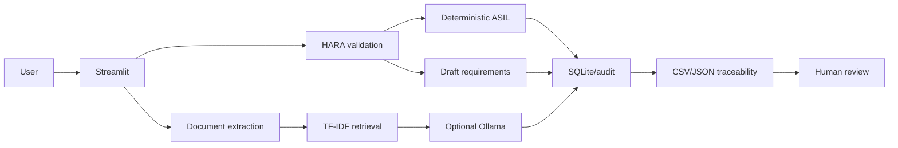

# Architecture

```mermaid
flowchart LR
 A[User] --> B[Streamlit]
 B --> C[HARA validation]
 C --> D[Deterministic ASIL]
 C --> E[Draft requirements]
 B --> F[Document extraction]
 F --> G[TF-IDF retrieval]
 G --> H[Optional Ollama]
 D --> I[SQLite/audit]
 E --> I
 H --> I
 I --> J[CSV/JSON traceability]
 J --> K[Human review]
```
Uploaded documents are session-only. HARA records persist in SQLite. The application is local-first and not production hardened.
