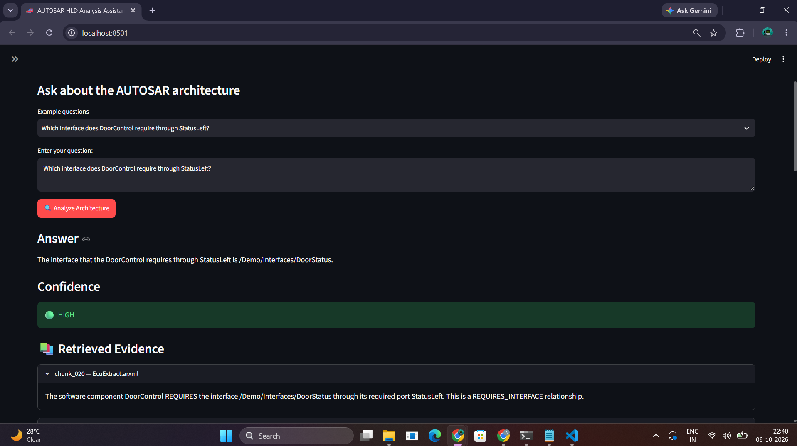
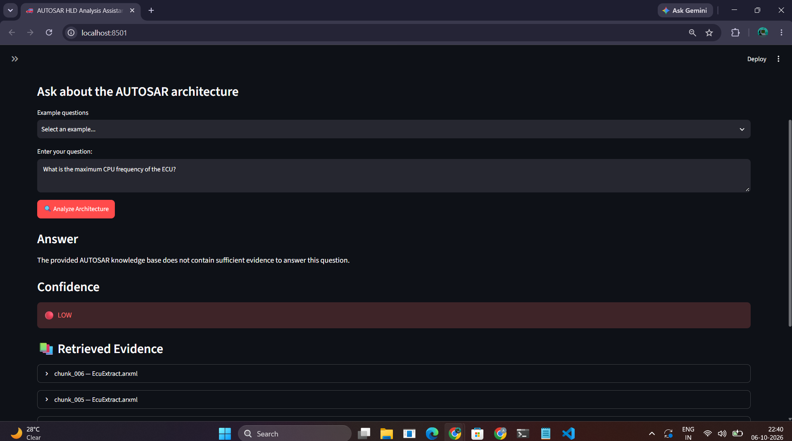

# Checkpoint 6: Streamlit Demonstration Interface

## Objective

Develop an interactive Streamlit interface for the
AI-Powered AUTOSAR HLD Analysis Assistant.

## Implemented Features

- AUTOSAR architecture question input
- Example questions
- Semantic retrieval using FAISS
- Intent-aware retrieval reranking
- Local LLM generation using Ollama/Mistral
- Grounded responses
- Confidence indication
- Retrieved evidence display
- Retrieval score display
- Human oversight warning

## System Configuration

**Embedding Model:**  
all-MiniLM-L6-v2

**Generation Model:**  
Mistral through Ollama

**Vector Database:**  
FAISS

**Knowledge Base:**  
EcuExtract.arxml

## Demonstration

The Streamlit interface was tested using representative
AUTOSAR architecture questions.

The following elements are visible in the demonstration
screenshot:

1. **Project Title** — AI-Powered AUTOSAR HLD Analysis Assistant
2. **Question** — User's AUTOSAR architecture query
3. **Answer** — Grounded response generated using the retrieved evidence
4. **Confidence** — Confidence level associated with the retrieved evidence
5. **Retrieved Evidence** — Supporting AUTOSAR chunks retrieved from the knowledge base
6. **Sidebar Configuration** — Embedding model, generation model, vector database, retrieval configuration, and knowledge-base information

### Streamlit Interface Screenshot

The screenshot below demonstrates the complete application
interface containing the project title, question, generated
answer, confidence, retrieved evidence, and sidebar
configuration.

**Screenshot:**  

## Grounding Demonstration

An unsupported question was also tested:

**Question:**

> What is the maximum CPU frequency of the ECU?

The system responded that the provided AUTOSAR knowledge base
does not contain sufficient evidence to answer the question.

This demonstrates the system's evidence-grounding and
insufficient-evidence handling behavior.

**Screenshot:**  

## Human Oversight

The interface clearly indicates that AI-generated analysis
must be verified against the original AUTOSAR ARXML.

The system is intended to assist engineers and does not
replace engineering review or approval.

## Checkpoint Outcome

The Streamlit interface successfully provides an interactive
front end for the AUTOSAR HLD analysis pipeline, connecting
the user question to semantic retrieval, grounded LLM
generation, confidence estimation, and supporting evidence.