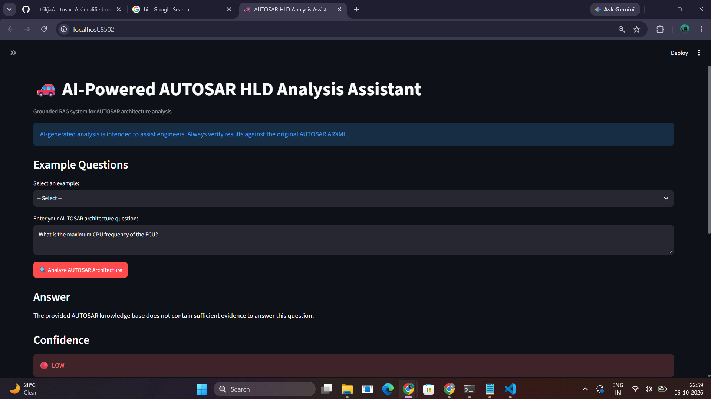

# Checkpoint 7: Reusable RAG Backend

## Objective

Refactor the AUTOSAR HLD RAG system into a reusable
pipeline that can be accessed by the Streamlit interface,
command-line testing, and evaluation scripts.

## Architecture

The reusable RAG pipeline follows:

User Question
→ Semantic Retrieval
→ Intent-Aware Reranking
→ Evidence Sufficiency Check
→ Grounded Prompt Construction
→ Ollama/Mistral Generation
→ Confidence and Verified Evidence

## Main Component

The reusable pipeline is implemented in:

`Code/rag/rag_pipeline.py`

The main entry point is:

`answer_question()`

The function returns:

- Answer
- Confidence
- Evidence sufficiency
- Retrieved results
- Verified evidence citations

## Streamlit Integration

The Streamlit application in:

`Code/app.py`

uses the reusable `answer_question()` function rather
than implementing a separate RAG workflow.

This provides a single source of truth for the retrieval
and generation pipeline.

## Configuration

Embedding Model:

`all-MiniLM-L6-v2`

Generation Model:

`mistral:latest`

Vector Database:

`FAISS`

Knowledge Base:

`EcuExtract.arxml`

## Testing

The pipeline was tested using:

1. Which component provides DigitalServiceWrite?
2. Which interface does DoorControl require through StatusLeft?
3. What interfaces does the Door component provide?
4. What runnable entities are present in the architecture?
5. What is the maximum CPU frequency of the ECU?

The first four questions test supported AUTOSAR architecture
queries.

The fifth question tests insufficient-evidence handling.

## Grounding

The system generates an answer only when the retrieved
evidence satisfies the configured evidence threshold.

For unsupported questions, the system returns an
insufficient-evidence response rather than inventing
AUTOSAR information.

## Human Oversight

The system is an engineering-assistance tool.

Generated answers must be verified against the original
AUTOSAR ARXML and do not replace engineering review,
approval, or safety-related engineering decisions.

## Screenshot

## Outcome

The RAG logic is now separated from the user interface and
exposed through a reusable `answer_question()` function.

This improves modularity, maintainability, testing, and
future integration with other interfaces such as APIs.