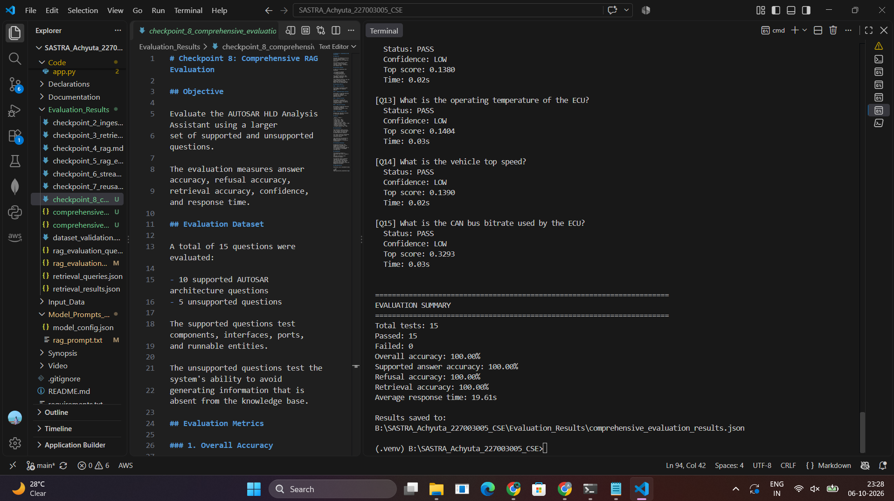

# Checkpoint 8: Comprehensive RAG Evaluation

## Objective

Evaluate the AUTOSAR HLD Analysis Assistant using a larger
set of supported and unsupported questions.

The evaluation measures answer accuracy, refusal accuracy,
retrieval accuracy, confidence, and response time.

## Evaluation Dataset

A total of 15 questions were evaluated:

- 10 supported AUTOSAR architecture questions
- 5 unsupported questions

The supported questions test components, interfaces, ports,
and runnable entities.

The unsupported questions test the system's ability to avoid
generating information that is absent from the knowledge base.

## Evaluation Metrics



### 1. Overall Accuracy

Percentage of evaluation cases that produced the expected
behavior.

### 2. Supported Answer Accuracy

Percentage of supported questions for which all expected
keywords were present in the generated answer.

### 3. Refusal Accuracy

Percentage of unsupported questions for which the system
correctly refused to provide an unsupported answer.

### 4. Retrieval Accuracy

Percentage of supported questions for which the expected
information was present in the retrieved evidence.

### 5. Average Response Time

Average time required to process an evaluation question.

## Results

| Metric | Result |
|---|---:|
| Total tests | 15 |
| Passed tests | 15 |
| Failed tests | 0 |
| Overall accuracy | 100.00% |
| Supported answer accuracy | 100.00% |
| Refusal accuracy | 100.00% |
| Retrieval accuracy | 100.00% |
| Average response time | 19.61s |

## Interpretation

The evaluation results will be used to assess the effectiveness
of the semantic retrieval and grounded generation pipeline.

The results should be interpreted only within the scope of the
evaluation dataset.

They should not be presented as general accuracy across all
AUTOSAR documents or automotive architectures.

## Grounding Evaluation

Unsupported questions were deliberately included to test
whether the system avoids hallucinating information that is
not contained in the AUTOSAR knowledge base.

## Limitations

The evaluation dataset is relatively small and is based on the
available EcuExtract.arxml architecture example.

The measured results therefore represent the performance of
this prototype on the selected evaluation cases rather than
generalized performance across all AUTOSAR HLD documents.

## Reproducibility

Evaluation can be reproduced using:

```text
python Code\rag\evaluate_comprehensive.py